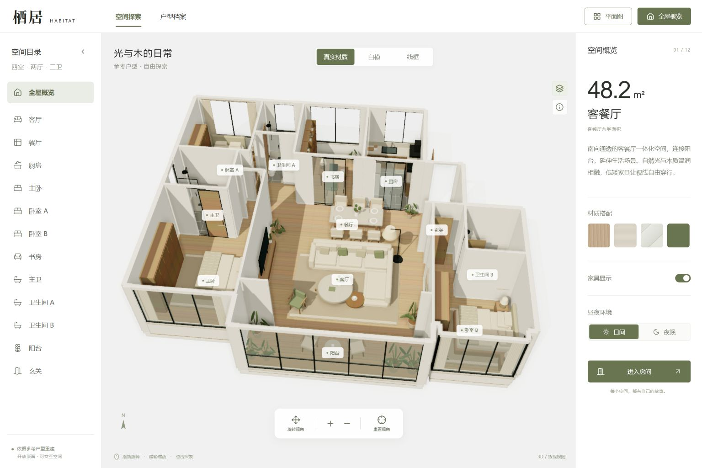

# 栖居 · 3D 家居漫游

根据所提供户型图制作的 React + Three.js 交互住宅。所有家具、建筑和材质均在本地构建，无远程模型或服务依赖。



## 打开

首次克隆请按下方命令安装依赖并构建。生成独立网页后，可直接双击 **dist/standalone.html**，或上一层目录的 **栖居3D.html**。独立网页包含代码、纹理生成逻辑和原始户型图，支持离线使用。需要支持 WebGL 2 的浏览器。

## 操作

- 左键拖动旋转、右键平移、滚轮缩放；触屏单指旋转、双指缩放和平移。
- 点击左侧目录或模型标签选择空间；点击家具查看说明和材质，再用“近距离查看”聚焦家具。
- 进入房间后，拖动环顾，W/A/S/D 或方向键移动；画面内方向键可用于触屏。移动限制在当前房间边界内，可从目录直接切换至其他房间。Esc 返回全屋。
- 真实材质、白模与线框共用同一模型；平面图使用正交俯视并默认线框，返回 3D 恢复切换前材质。
- 家具开关控制全部陈设；夜间自动开启各房间的暖色点光源及灯罩自发光。
- 户型档案显示原始参考图。

## 开发与构建

环境：Node.js 20.11 或更高版本，以及 pnpm。在项目根目录运行：

```sh
pnpm install
pnpm build
node scripts/standalone.mjs
pnpm preview --port 5173
```

浏览器打开 `http://127.0.0.1:5173`。开发时可运行 `pnpm dev`。仓库只保存源码和必要素材，依赖目录和构建产物不提交。

受管 Windows 环境中 Vite 开发依赖预打包可能遇到目录读取限制；已验证的运行方式是构建后 `preview`。生产包和独立 HTML 不依赖开发服务器。

## 文件

- `src/plan.js`：沿原图像素坐标描出的墙段、门洞、窗段、外轮廓和房间多边形；建筑与漫游共用这一份几何数据。
- `src/data.js`：12 个空间、原图面积标注与讲解。
- `src/world.js`：无天花板建筑、家具、程序纹理、灯光、射线拾取、漫游和平面图。
- `src/App.jsx` / `src/style.css`：界面与响应式布局。
- `scripts/standalone.mjs`：把生产包和参考图内联为离线 HTML。

本版按北侧 10.3 m 墙长统一缩放原图描线坐标，没有逐房间拉伸。房间面积保留原图文字标注，不是由模型重新计算；客厅、餐厅共享 48.2 ㎡，书房计入四室。

墙体统一为 3 m，不随概览或室内视角压低。门扇高 2.85 m，窗顶高 2.85 m，门窗上方补齐至墙顶，保持无天花板展示。正交平面图隐藏开口上方的墙段，以便阅读门洞。

书房、厨房和主卫按用户要求采用移门；主卫为单扇沿墙滑动，覆盖原图的平开符号。客厅与阳台取消移门及轨道，两端短墙垛保留，连续木地板连接为一体，漫游可从中间开口直接通行。阳台南侧保留完整封窗。厨房与三个卫生间铺瓷砖，其余所有空间铺同一种木地板。

主卧床头靠客厅电视墙的卧室一侧；卧室 B 床头靠东侧外墙，衣柜移至西侧，床头柜随床位调整。卧室 A 东侧入口、主卧入口凹位、卧室 B 的 L 形入口及卫生间 B 西侧门洞均按原图定位。门扇属于建筑构件，隐藏家具时仍然显示。

高度和床位采用最新设计要求，框型、移门扇数及陈设为设计演示。参考户型图保存在 `public/floorplan-reference.png`，当前实现已取消客厅—阳台移门。

模型浏览使用 [Three.js OrbitControls](https://threejs.org/docs/pages/OrbitControls.html)，家具选择使用 [Raycaster](https://threejs.org/docs/pages/Raycaster.html)。
